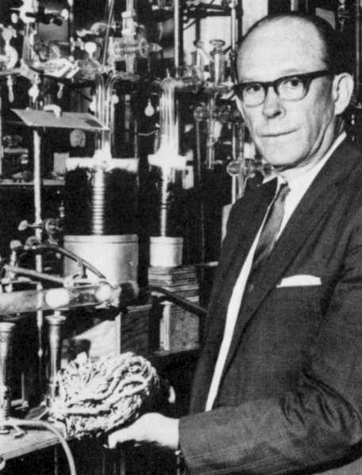

class: Large
```{r setup, include=FALSE}
knitr::opts_chunk$set(echo = FALSE)
library(tidyverse)
library(patchwork)
library(rbacon)
library(ggtext)
library(htmltab)
theme_set(theme_bw(base_size = 17))
```
## Types of Chronologies

* Incremental
	- Varved sediments
* Radiometric
	- Radiocarbon
	- Lead-210
* Stratigraphic
	- Tephra layers
---
class: inverse
background-image: url("figures/de_geer.jpeg")

## Varved Lake Sediments

---
class: Large

- How are they formed & preserved?
- What types of lakes have varved sediments?
- Techniques
- Can they be proved to be annual?
- An example of their use.

---

class: title-slide

# Radiocarbon Dating

---
class: large
# <sup>14</sup>C Principles 

.pull-left[

Developed by Libby
]

.pull-right[98.9% of carbon atoms have 6 protons and 6 neutrons in their nucleus: <sup>12</sup>C

1.1% have 6 protons and 7 neutrons: <sup>13</sup>C

<sup>12</sup>C & <sup>13</sup>C are stable

<sup>14</sup>C: 1 in 10<sup>12</sup> atoms radioactive - half-life of 5730 years 	

Suitable for organic material and carbonates

Useful for sediments < ~50 000 years old

Dates given as years before present = 1950 (yr BP)
]


???
Photo from
https://enciklopedija.hr/natuknica.aspx?ID=36340

---
# Beta decay of <sup>14</sup>C

$^{14}C → ^{14}N + β + \bar{v}_e$

β – Beta-particle – high energy electron

$\bar{v}_e$ electron antineutrino – very difficult to detect

Random process

Atom has 50% chance of decaying in one half-life yrs

Exponential decay

---
# Measuring <sup>14</sup>C

1 Count the disintegrations  
  - Detect β particles
  - Radiometric or bulk date
  - Needs 1 g carbon
  
2 Count the atoms
  - Accelerated Mass Spectrometer
  - Needs 1 mg carbon
  - Can date specific sediment fractions


---
## Calculating <sup>14</sup>C Age

.pull-left[
```{r halflives}
halflives <- tibble(n = 1:5, activity = 1/(2^n), age = 5568 *n)
tibble(age = seq(0, 50000, 200), 
       activity = exp(-log(2)*age/5568)) %>% 
  ggplot(aes(x = age, y = activity)) +
  geom_line() +
  geom_segment(data = halflives, aes(x = age, xend = 0, y = activity, yend = activity, colour = n), show.legend = FALSE) +
  geom_segment(data = halflives, aes(x = age, xend = age, y = activity, yend = 0, colour = n), show.legend = FALSE) +
  scale_colour_viridis_c() + 
  labs(x = "Years", y = "Proportion modern activity")
```
]
.pull-right[
$\frac{dA}{dt} = -\lambda A$

$A = A_{initial}e^{-\lambda t}$

$\lambda = \frac{ln(2)}{halflife}$

$A = A_{initial}e^{-ln(2)\frac{age}{halflife}}$

<!-- $ln(\frac{A}{A_{initial}})=-ln(2)\frac{age}{halflife}$ -->

$age = -ln(\frac{A}{A_{initial}})\frac{halflife}{ln(2)}$

Use Libby halflife 5568

$age = -8033 ln(\frac{A}{A_{initial}})$ 

assume $A_{initial} = A_{modern}$ 

$age= -8033 ln(\frac{A}{A_{modern}})$ 
]


---
# Assumptions

1 No contamination
  - <sup>14</sup>C tracers
	- rootlets
	- recrystallisation 
	- bioturbation
	- coal & peat
	
2 <sup>14</sup>C in organism is in equilibrium with atmosphere at death
	- fractionation
	- marine reservoir effect
	- hardwater error
	
3 Atmospheric <sup>14</sup>C concentration is constant

---
## Marine reservoir effect $\Delta$ R


```{r load-delta-14C, cache=TRUE, message = FALSE}
delta14C <- htmltab(doc = "data/CHRONO Marine Database.html", which = 2, rm_nodata_cols = FALSE) %>% 
  mutate(across(c(Lon, Lat, DeltaR), as.numeric))
```

```{r delta-14C-map, fig.height = 8, fig.width = 12}
gradient_setter <- function(x, low = NULL, mid = 0, high = NULL){
  rn <- range(x, na.rm = TRUE)
  (c(rn[1], low, mid, high, rn[2]) - rn[1])/(rn[2] - rn[1])
}
mp <- map_data("world")
ggplot(delta14C, aes(x = Lon, y = Lat, colour = DeltaR)) +
  geom_map(map = mp, data = mp, aes(map_id = region), inherit.aes = FALSE, fill = "grey50") +
  geom_point() +
  coord_quickmap() + 
  scale_colour_gradientn(colours = c("red", "grey80", "blue", "darkblue"), values = gradient_setter(delta14C$DeltaR, high = 500)) +
  labs(x = "°E", y = "°N", colour = expression(Delta*R~yr))

```

---

# Calibration Curves

IntCal20 and Marine20 0-55000 BP

```{r cal_curve, fig.height = 6.5, fig.width=8.5, message = FALSE}
intcal <- bind_rows(
  intcal20 = copyCalibrationCurve(1),
  marine20 = copyCalibrationCurve(2), 
  .id = "Curve")
intcal2 <- bind_rows(
  `1` = intcal,
  `2` = intcal %>% mutate(V3 = V3 * 2),
  .id = "sd"
) %>% 
  arrange(desc(sd))
main <- intcal2 %>% 
  filter(V1 <= 13000) %>% 
ggplot(aes(x = V1, y = V2, ymin = V2 - V3, ymax = V2 + V3, fill = Curve, alpha = sd)) +
  geom_ribbon(show.legend = FALSE) + 
#  coord_equal() +
  scale_alpha_manual(values = c(1, .3)) +
  scale_fill_brewer(palette = "Set1") +
  scale_x_reverse() +
  labs(x = "Years cal BP", 
       y = expression(phantom(0)^{14}*C~years~BP))

zoom1 <- main %+% 
  filter(intcal2, between(V1, 2000, 3000)) + 
  scale_x_reverse(n.breaks = 3)
zoom2 <- zoom1 %+% 
  filter(intcal2, between(V1, 20000, 21000))

main +
  patchwork::plot_layout(
    widths = c(.6, .4), 
    guides = "collect"
    ) +
  plot_annotation(
    title = "<span style = 'color:#E41A1C;'>IntCal20</span>
and <span style = 'color:#377EB8;'>Marine20</span> Calibration Curves", 
    theme = theme(plot.title = element_markdown())
)
```

---

```{r calcurve-zoom, fig.width = 8.5}
zoom1 + zoom2 +  
  plot_annotation(
    title = "<span style = 'color:#E41A1C;'>IntCal20</span>  and <span style = 'color:#377EB8;'>Marine20</span> Calibration Curves", 
    theme = theme(plot.title = element_markdown())
  )
```


---
class: inverse
background-image: url("figures/goalsSunYohkoh.jpg")


## The Changing Sun

X-ray images of the sun over half a sunspot cycle (1991-1995)


```{r sunspots, dev.args = list(bg = 'transparent'), fig.height = 5.5, fig.width = 10.5, message=FALSE}
sunspots <- read_delim("data/SN_y_tot_V2.0.csv", 
                       delim = ";",
                     col_names = c("year", "sunspots", "sd", "n", "prov")) %>% 
  mutate(sunspots = str_trim(sunspots), 
         sunspots = as.numeric(sunspots))

sunspot_plot <- ggplot(sunspots, aes(x = year, y = sunspots)) +
  geom_line(colour = "white") +
  labs(x = "Year CE", y = "Number of Sunspots") +
  theme(panel.background = element_rect(fill = "transparent"), # bg of the panel
    plot.background = element_rect(fill = "transparent", color = NA), # bg of the plot
    axis.line = element_line(colour = "white"), 
    axis.text = element_text(colour = "white"), 
    axis.title = element_text(colour = "white"), 
    panel.grid = element_blank()
 )
(plot_spacer() + sunspot_plot) & theme(
    plot.background = element_rect(fill = "transparent", color = NA))
```

???
Sunspot data from http://www.sidc.be/silso/dayssnplot

---

## Reading

Varves: Zolitschka et al (2015) Varves in lake sediments - a review. Quaternary Science Reviews 117, 1–41

Radiocarbon: Reimer et al (2020) The IntCal20 Northern Hemisphere Radiocarbon Age Calibration Curve (0–55 cal kBP) Radiocarbon 62, 725-757 https://doi.org/10.1017/RDC.2020.41

Age depth models: Trachsel and Telford (2017) All age–depth models are wrong, but are getting better. The Holocene 27, 860–869 

210Pb dating: Appleby (2008) Three decades of dating recent sediments by fallout radionuclides: a review. The Holocene 18, 83–93

Cryptotephra: Davis (2015) Cryptotephras: the revolution in correlation and precision dating. Journal of Quaternary Science 30, 114–130. https://doi.org/10.1002/jqs.2766
