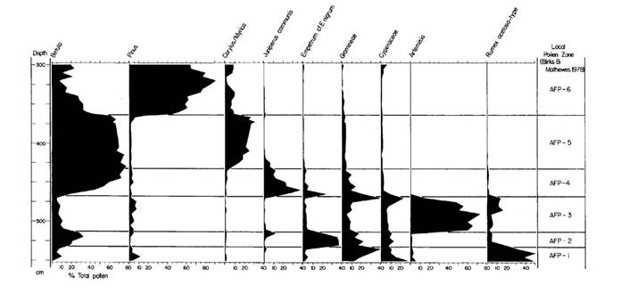
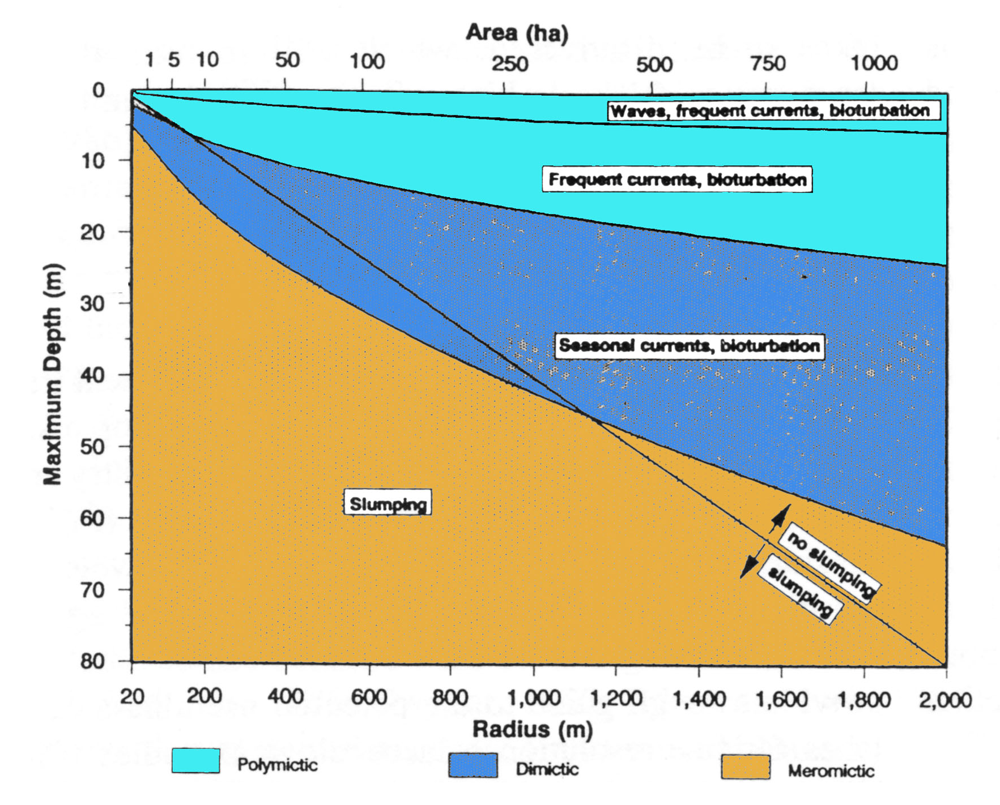
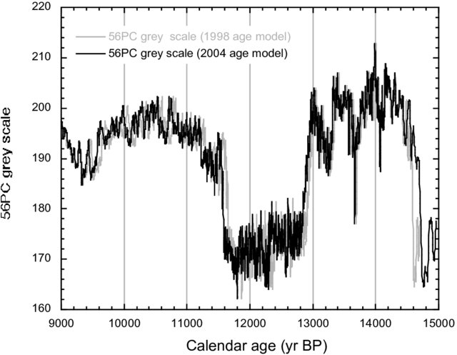
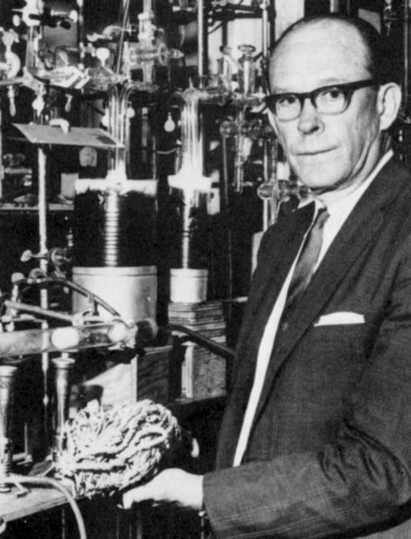
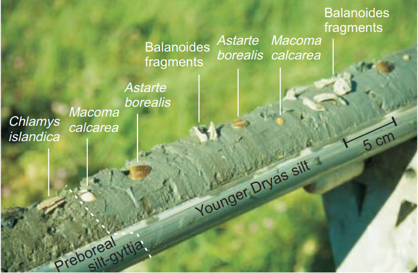
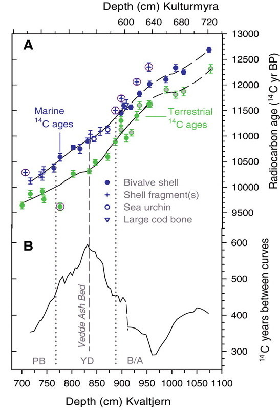
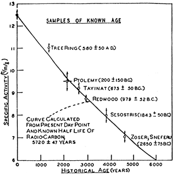
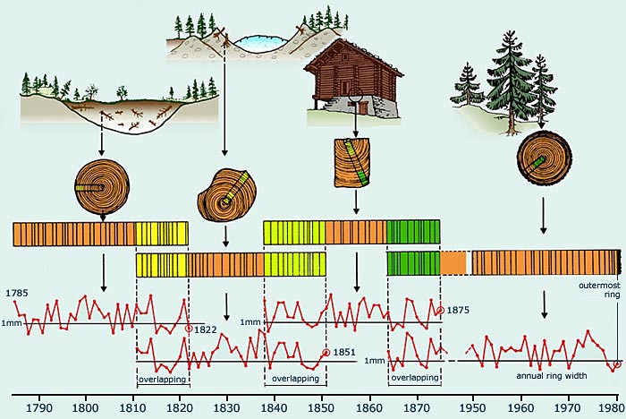
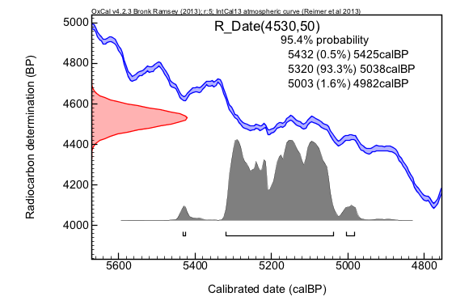

class: Large
```{r setup, include=FALSE}
knitr::opts_chunk$set(echo = FALSE)
library(tidyverse)
library(patchwork)
library(rbacon)
library(ggtext)
library(htmltab)
theme_set(theme_bw(base_size = 17))
```


### Why date



--
.pull-left[
Without dates: 
- Things changed.
- Order of events
]
--
.pull-right[
With dates:
- When?
- How fast?
- What happened at the same time?
- Hypothesis testing]
---

## Introduction

Absolute chronology is the basis for all comparison and correlation of Holocene proxy records.

Avoid visual 'curve-matching' 
 - 'reinforcement syndrome' 
 - 'suck-in and smear'

- Mostly <sup>14</sup>C dating and <sup>210</sup>Pb dating. 
- Tephras increasingly important. 
- Holocene-length annually laminated sediments rare.

---

## Types of Chronologies

Relative vs Absolute

* Incremental
	- Varved sediments
* Radiometric
	- Radiocarbon
	- Lead-210
* Stratigraphic
	- Tephra layers
---
class: inverse
background-image: url("figures/de_geer.jpeg")
background-position: right

## Varved Lake Sediments

.pull-left[
- How are they formed & preserved?
- What types of lakes have varved sediments?
- Techniques
- Can they be proved to be annual?
]
---
background-image: url("figures/geol_deglac8.jpg")
background-size: contain

## Varve formation and preservation

1 Seasonal variation in the type of sediment deposited
- grain size in pro-glacial lake
- biological remains
- Calcite

2 Sediment water interface undisturbed
- by waves & currents
- by bioturbation
- by slumping

---
background-image: url("figures/Sagtjennet_organic-macro.jpg")
class: inverse
## Sagtjennet
???
http://www.pages.unibe.ch/download/docs/meeting-products/abstracts/VWG_AbstractVolume_Final_2012.pdf

---
## Lake Characteristics

--


---
## Varves in Marine Environments
.pull-left[
Common in enclosed marginal seas
-	Saanich Inlet, British Columbia
-	Baltic Sea
-	Black Sea
-	Cariaco Basin
Also under up-welling zones
]
.pull-right[


Cariaco Basin greyscale for the deglaciation
Hugen et al 2004
]
---
## Techniques

Coring – need continuous sequence

Frozen finger to sample sediment water interface

Embed in epoxy resin to make thin sections

---
background-image: url("figures/bald-core.jpg")
background-position: right

.pull-left[
## Evidence that Varves are Annual
]

---
background-image: url("figures/microstratigraphy.jpg")
background-position: right

.pull-left[
## Evidence that Varves are Annual

Radiometric dates

Pollen

Microstratigraphy
]

---
background-image: url("figures/bald-core.jpg")
background-position: right

.pull-left[
## Baldeggersee, Switzerland

Hypertrophic lake

Cored with freeze-corer

Diatoms counted at annual resolution
]
---
background-image: url("figures/bald-diatoms.png")


---
class: title-slide

# Radiocarbon Dating

---
class: large
# <sup>14</sup>C Principles 

.pull-left[

Developed by Libby
]

.pull-right[98.9% of carbon atoms have 6 protons and 6 neutrons in their nucleus: <sup>12</sup>C

1.1% have 6 protons and 7 neutrons: <sup>13</sup>C

<sup>12</sup>C & <sup>13</sup>C are stable

<sup>14</sup>C: 1 in 10<sup>12</sup> atoms radioactive - half-life of 5730 years 	

Suitable for organic material and carbonates

Useful for sediments < ~50 000 years old

Dates given as years before present = 1950 (yr BP)
]


???
Photo from
https://enciklopedija.hr/natuknica.aspx?ID=36340

---
## Origin of <sup>14</sup>C

--
Cosmic radiation hits upper atmosphere
--
Nuclei broken into high-energy nucleotides
--
<sup>14</sup>C formed by exchange of p for n in Nitrogen atom
--
<sup>14</sup>C absorbed by biomass and moves through the food chain

Everything is radioactive

---
## Beta decay of <sup>14</sup>C

$^{14}C → ^{14}N + β + \bar{v}_e$

β – Beta-particle – high energy electron

$\bar{v}_e$ electron antineutrino – very difficult to detect

Random process

Atom has 50% chance of decaying in one half-life yrs

Exponential decay

---
# Measuring <sup>14</sup>C

1 Count the disintegrations  
  - Detect β particles
  - Radiometric or bulk date
  - Needs 1 g carbon
  
2 Count the atoms
  - Accelerated Mass Spectrometer
  - Needs 1 mg carbon
  - Can date specific sediment fractions


---
## Calculating <sup>14</sup>C Age

.pull-left[
```{r halflives}
halflives <- tibble(n = 1:5, activity = 1/(2^n), age = 5568 *n)
tibble(age = seq(0, 50000, 200), 
       activity = exp(-log(2)*age/5568)) %>% 
  ggplot(aes(x = age, y = activity)) +
  geom_line() +
  geom_segment(data = halflives, aes(x = age, xend = 0, y = activity, yend = activity, colour = n), show.legend = FALSE) +
  geom_segment(data = halflives, aes(x = age, xend = age, y = activity, yend = 0, colour = n), show.legend = FALSE) +
  scale_colour_viridis_c() + 
  labs(x = "Years", y = "Proportion modern activity")
```
]
.pull-right[
$\frac{dA}{dt} = -\lambda A$

$A = A_{initial}e^{-\lambda t}$

$\lambda = \frac{ln(2)}{halflife}$

$A = A_{initial}e^{-ln(2)\frac{age}{halflife}}$

<!-- $ln(\frac{A}{A_{initial}})=-ln(2)\frac{age}{halflife}$ -->

$age = -ln(\frac{A}{A_{initial}})\frac{halflife}{ln(2)}$

Use Libby halflife 5568

$age = -8033 ln(\frac{A}{A_{initial}})$ 

assume $A_{initial} = A_{modern}$ 

$age= -8033 ln(\frac{A}{A_{modern}})$ 
]


---
# Assumptions

1 No contamination
- <sup>14</sup>C tracers
- rootlets
- recrystallisation 
- bioturbation
- coal & peat
	
2 <sup>14</sup>C in organism is in equilibrium with atmosphere at death
- fractionation
- marine reservoir effect
- hardwater error
	
3 Atmospheric <sup>14</sup>C concentration is constant

---
# Isotopic Fractionation

- <sup>14</sup>C is heavier and slower than <sup>12</sup>C
- <sup>14</sup>C discriminated against by photosynthesis & other processes 
- <sup>13</sup>C also discriminated against
- normalise to $\delta ^{13}C = -25 ‰$
- 16 yr offset per 1 ‰


Material |	$\delta ^{13}C ‰$
---------|------------
Marine shells|	+1 ± 2
Speleothems|	-9 ± 3
C-4 plants|	-10 ± 2 
Marine organisms (organic)|	-15 ± 3
Freshwater plants (submerged)|	-16 ± 4
C3 plants, wood, charcoal|	-25 ± 3


---
## Marine reservoir effect 

- Ocean contains lots of C
- Exchange with atmosphere is slow
- <sup>14</sup>C decays before exchange
- →Average apparent age of marine organisms 400 yr too old

---
class: inverse
background-image: url("figures/Lofotlam_sau_spiser_tang_Røst_lofoten.jpg")

## How old do these sheep appear to be?

How could you tell?

---
## Marine Reservoir Effect Varies in Space

$\Delta R$ - offset from typical reservoir age

```{r load-delta-14C, cache=TRUE, message = FALSE}
delta14C <- htmltab(doc = "data/CHRONO Marine Database.html", which = 2, rm_nodata_cols = FALSE) %>% 
  mutate(across(c(Lon, Lat, DeltaR), as.numeric))
```

```{r delta-14C-map, fig.height = 8, fig.width = 12}
gradient_setter <- function(x, low = NULL, mid = 0, high = NULL){
  rn <- range(x, na.rm = TRUE)
  (c(rn[1], low, mid, high, rn[2]) - rn[1])/(rn[2] - rn[1])
}
mp <- map_data("world")
ggplot(delta14C, aes(x = Lon, y = Lat, colour = DeltaR)) +
  geom_map(map = mp, data = mp, aes(map_id = region), inherit.aes = FALSE, fill = "grey50") +
  geom_point() +
  coord_quickmap() + 
  scale_colour_gradientn(colours = c("red", "grey80", "blue", "darkblue"), values = gradient_setter(delta14C$DeltaR, high = 500)) +
  labs(x = "°E", y = "°N", colour = expression(Delta*R~yr))

```

---
## And Varies in Time

.pull-left[

- Marine and terrestrial macrofossils in same core
- Difference between marine and terrestrial <sup>14</sup>C dates is not constant
- [Bondevik et al (2006) Science](https://science.sciencemag.org/content/312/5779/1514)
]
.pull-right[

]

---
## Hard-water error

- Catchment carbonates low in <sup>14</sup>C dissolve
- Aquatic plants photosynthesise using “old” carbon
- Apparent age older than true age
- Solve by dating terrestrial macrofossils or pollen

---
## Is atmospheric <sup>14</sup>C concentration constant?

.pull-left[
"Curve of Knowns" Libby and Arnold (1949)]

.pull-right[
- First <sup>14</sup>C dates near expected
- More dates showed divergence
- Who was right, the archaeologists or the physicists?
]
---
### Dendrochronological evidence



Also macrofossils in varved lakes

Corals dates with <sup>14</sup>C and U/Th dating

???
https://www.geo.uzh.ch/microsite/alpecole/static/course/lessons/28/28c.htm
---
## Calibration Curves

IntCal20, SHCal20 and Marine20 0-55000 BP

```{r cal_curve, fig.height = 6.5, fig.width=8.5, message = FALSE}
intcal <- bind_rows(
  intcal20 = copyCalibrationCurve(1),
  marine20 = copyCalibrationCurve(2), 
  .id = "Curve")
intcal2 <- bind_rows(
  `1` = intcal,
  `2` = intcal %>% mutate(V3 = V3 * 2),
  .id = "sd"
) %>% 
  arrange(desc(sd))
main <- intcal2 %>% 
  filter(V1 <= 13000) %>% 
ggplot(aes(x = V1, y = V2, ymin = V2 - V3, ymax = V2 + V3, fill = Curve, alpha = sd)) +
  geom_ribbon(show.legend = FALSE) + 
#  coord_equal() +
  scale_alpha_manual(values = c(1, .3)) +
  scale_fill_brewer(palette = "Set1") +
  scale_x_reverse() +
  labs(x = "Years cal BP", 
       y = expression(phantom(0)^{14}*C~years~BP))

zoom1 <- main %+% 
  filter(intcal2, between(V1, 2000, 3000)) + 
  scale_x_reverse(n.breaks = 3)
zoom2 <- zoom1 %+% 
  filter(intcal2, between(V1, 20000, 21000))

main +
  patchwork::plot_layout(
    widths = c(.6, .4), 
    guides = "collect"
    ) +
  plot_annotation(
    title = "<span style = 'color:#E41A1C;'>IntCal20</span>
and <span style = 'color:#377EB8;'>Marine20</span> Calibration Curves", 
    theme = theme(plot.title = element_markdown())
)
```

---

```{r calcurve-zoom, fig.width = 8.5}
zoom1 + zoom2 +  
  plot_annotation(
    title = "<span style = 'color:#E41A1C;'>IntCal20</span>  and <span style = 'color:#377EB8;'>Marine20</span> Calibration Curves", 
    theme = theme(plot.title = element_markdown())
  )
```


---
class: inverse
background-image: url("figures/goalsSunYohkoh.jpg")


## The Changing Sun

X-ray images of the sun over half a sunspot cycle (1991-1995)


```{r sunspots, dev.args = list(bg = 'transparent'), fig.height = 5.5, fig.width = 10.5, message=FALSE}
sunspots <- read_delim("data/SN_y_tot_V2.0.csv", 
                       delim = ";",
                     col_names = c("year", "sunspots", "sd", "n", "prov")) %>% 
  mutate(sunspots = str_trim(sunspots), 
         sunspots = as.numeric(sunspots))

sunspot_plot <- ggplot(sunspots, aes(x = year, y = sunspots)) +
  geom_line(colour = "white") +
  labs(x = "Year CE", y = "Number of Sunspots") +
  theme(panel.background = element_rect(fill = "transparent"), # bg of the panel
    plot.background = element_rect(fill = "transparent", color = NA), # bg of the plot
    axis.line = element_line(colour = "white"), 
    axis.text = element_text(colour = "white"), 
    axis.title = element_text(colour = "white"), 
    panel.grid = element_blank()
 )
(plot_spacer() + sunspot_plot) & theme(
    plot.background = element_rect(fill = "transparent", color = NA))
```

???
Sunspot data from http://www.sidc.be/silso/dayssnplot

---
## Calibration

Convert radiocarbon dates to calibrated dates 



- Oxcal
- Bchron
- rbacon

--- 
background-image: url("figures/mushroom_cloud.jpg")


---
background-image: url("figures/mushroom_cloud.jpg")
background-position: right

## Dating sediment < 150 years old    

.pull-left[
Period of massive human impact on the environment
- acid rain
- eutrophication
- climate change

Nuclear bomb-derived <sup>14</sup>C
<sup>210</sup>Pb 
- half-life 22 years
- part of decay chain from <sup>238</sup>U 
]
---
## Postbomb-calibration curve – Northern Hemisphere
.pull-left[
```{r post-bomb, fig.width=5, fig.height=5}
pb <- readxl::read_excel("data/16177-21074-1-SP.xls", sheet = "NH zone 1", skip = 5, col_names = c("Year", "Delta14C", "Delta13C_err", "F14C", "F14C_err"))

pb %>% ggplot(aes(x = Year, y = F14C, ymax = F14C + F14C_err, ymin = F14C - F14C_err)) +
  geom_line() +
  labs(x = "Year CE", y = expression(F^{14}*C), title = "Northern Hemisphere Post-Bomb 14C")

```
]
.pull-right[
Why did the curve rise?

Why did it decline?

Hua et al (2013) Radiocarbon
]
---

## Reading

Varves: Zolitschka et al (2015) Varves in lake sediments - a review. Quaternary Science Reviews 117, 1–41

Radiocarbon: Reimer et al (2020) The IntCal20 Northern Hemisphere Radiocarbon Age Calibration Curve (0–55 cal kBP) Radiocarbon 62, 725-757 https://doi.org/10.1017/RDC.2020.41

Age depth models: Trachsel and Telford (2017) All age–depth models are wrong, but are getting better. The Holocene 27, 860–869 

210Pb dating: Appleby (2008) Three decades of dating recent sediments by fallout radionuclides: a review. The Holocene 18, 83–93

Cryptotephra: Davis (2015) Cryptotephras: the revolution in correlation and precision dating. Journal of Quaternary Science 30, 114–130. https://doi.org/10.1002/jqs.2766
